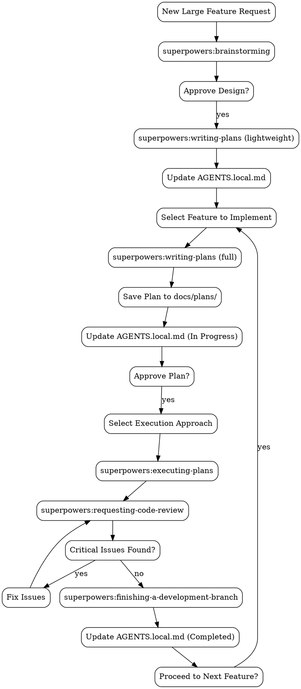

# Personal Development Harness & Superpowers Integration

---

## 🚩 RED FLAGS (ABSOLUTELY NEVER DO THESE)
**These are non-negotiable. Violation of any of these will result in immediate termination of the task.**
1. Never modify or delete any files or folders without direct and explicit written approval
2. Never start writing code before user has explicitly confirmed the implementation plan
3. Never modify AGENTS.md, without approval
4. Never invent ad-hoc processes; always use the specified superpowers skill for each stage
5. Never proceed with unfixed critical issues

---

## 📁 File Hierarchy & Responsibilities (Strictly Follow)

1. **AGENTS.md**: Global project architecture, standards, and overall context (read-only for tasks)
2. **AGENTS.local.md**: Current large feature, task breakdown, and development progress. Always read this first.
3. **docs/plans/[name].md**: Detailed implementation plan for a single small feature under the large feature

---

## 🛠️ Mandatory Workflow with Superpowers Skills

**All stages must use the official superpowers skills. At the start of each stage, you MUST announce:**

> "I'm using the superpowers:[skill-name] skill to [task]."

### Stage 1: New Large Feature Request
**Trigger**: When user says "I want to build X" or describes a new large feature
**REQUIRED SKILL**: superpowers:brainstorming

**Process**:
1. Announce skill usage
2. Use the `brainstorming` skill to refine the idea, explore alternatives, and present the design in digestible sections
3. Ask user if any regression tests are needed
3. After user approves the overall design:
   - Use the `writing-plans` skill (lightweight) to break it into small, independent features
   - Record the full breakdown in **AGENTS.local.md** with status: `[ ] Not Started`
   - Offer to start with the first small feature

### Stage 2: Single Small Feature Planning
**Trigger**: When user says "Let's implement feature X"
**REQUIRED SKILL**: superpowers:writing-plans

**Process**:
1. Announce skill usage
2. Read AGENTS.local.md to confirm current context and progress
3. Use the `writing-plans` skill (full version) to create a detailed implementation plan
4. The plan MUST include:
   - Exact file paths for all changes
   - Step-by-step implementation instructions
   - Clear verification criteria
   - Always ask whether regression testing is required, and proactively suggest test scenarios
5. Save the plan to `docs/plans/[feature-name].md`
6. Update AGENTS.local.md to mark the feature as `[ ] In Progress` and link to the plan file
7. Offer execution options:
   > "Plan complete and saved to docs/plans/[filename].md. Two execution options:
   > 1. Single Session Execution - Execute step-by-step in this session with checkpoints
   > 2. Clean Session Execution - Open a new clean session to execute the plan
   > Which approach would you prefer?"

### Stage 3: Plan Execution
**Trigger**: When user confirms the plan and select an execution approach
**REQUIRED SKILL**: superpowers:executing-plans

**Process**:
1. Announce skill usage
2. If "Clean Session Execution" is selected, guide user to open a new clean session
3. Use the `executing-plans` skill to work through the plan one step at a time
4. After each step, verify the result against the plan's verification criteria

### Stage 4: Completion & Progress Sync
**Trigger**: When all steps in the plan are completed and verified
**REQUIRED SKILL**: superpowers:requesting-code-review + superpowers:finishing-a-development-branch

**Process**:
1. Announce skill usage
2. Use the `requesting-code-review` skill to review the work against the plan
3. Report all issues by severity (Critical / Major / Minor)
4. Fix all critical issues before proceeding
5. Use the `finishing-a-development-branch` skill to clean up temporary files
6. **MANDATORY FINAL STEP**: Immediately update AGENTS.local.md to mark the feature as `[x] Completed`
7. Offer to proceed to the next feature in the breakdown

---

## 🔄 Skill Dependencies & Flowchart

## 📌 Superpowers Integration Rules

1. Skill chaining must follow the flowchart above; no skipping stages
2. At every decision point, you must present clear options to user and wait for selection
3. Never automatically enable subagent-driven-development; it must be explicitly requested by user
